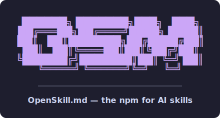

<p align="center">
  
</p>

<p align="center"><b>OpenSkill.md</b> — the npm for AI skills.<br>
Search, install, score, and publish skills, blueprints, and MCP servers for AI agents.</p>

```bash
npm i -g @openskillmd/osm@beta
osm search <query>
```

- 🌐 [openskill.md](https://openskill.md)
- 📦 CLI: [`@openskillmd/osm`](https://www.npmjs.com/package/@openskillmd/osm) (alias [`openskillmd`](https://www.npmjs.com/package/openskillmd))
- 🧭 [Router skill](https://github.com/openskillmd/router) — teaches agents to discover and install skills on demand
