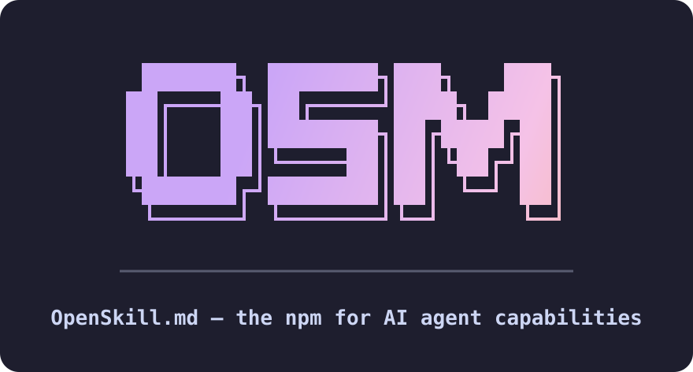

<p align="center">
  
</p>

<h3 align="center">The npm for AI agent capabilities</h3>

<p align="center">Search, install, score, and publish AI agent capabilities — skills, blueprints, MCP servers, and plugins.</p>

<p align="center">
  <a href="https://openskill.md">openskill.md</a> ·
  <a href="https://www.npmjs.com/package/@openskillmd/osm">CLI on npm</a> ·
  <a href="https://github.com/openskillmd/router">Router skill</a>
</p>

```bash
npm i -g @openskillmd/osm@beta
osm search <query>
```
